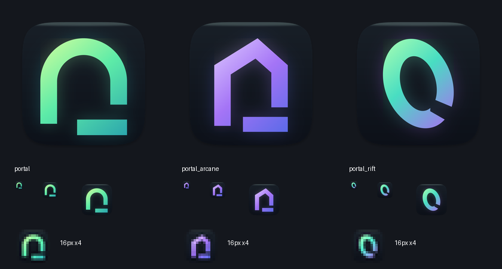

# Goblin Portal icon



The columns are `portal`, `portal_arcane`, and `portal_rift`. Each includes a
256px preview, actual 16/32/64px rasters, and a nearest-neighbor 4× enlargement
of the 16px raster (no additional detail).

- **portal — default.** An eldritch lime-to-jade-to-teal arch on a dark slate
  squircle. One shortened jamb and an offset threshold make the doorway feel
  alive without adding a literal character. The wide dark opening and 112px
  jambs preserve the silhouette at 16px. This has the clearest doorway reading.
- **portal_arcane.** Violet crystalline gate with an off-center peaked lintel.
  More architectural and arcane; its roof can also suggest a house.
- **portal_rift.** A leaning, broken elliptical ring with a green/teal/violet
  ramp. More otherworldly and kinetic, but less explicitly a doorway.

All marks are generated with Pillow, using the existing gradient, squircle,
shadow, and iconutil pipeline. The legacy prompt, caret, cursorline, inverse,
and path treatments remain available; no application theme presets changed.

## Reproduction

```sh
python3 app/Scripts/make-icon.py --all
python3 app/Scripts/make-icon.py --icns
cp app/build/icon/GoblinPortal.icns app/Resources/GoblinPortal.icns
cp app/build/icon/icon_1024.png app/Resources/icon-1024.png
```

## Verification

- All 12 registered variants generated successfully.
- Default 1024px PNG and ICNS generated and resource copies byte-checked.
- Visual comparison selected the green arch; a small-size review prompted a
  wider opening, then confirmed the final 16px raster retains its dark opening.
- `cd app && swift build` passed after `Scripts/bootstrap-vendor.sh` installed
  the fresh worktree's pinned SwiftTerm dependency. Existing Selector warnings.
- `cd app && ./Scripts/check-file-size.sh` passed: generator 330 lines,
  path helper 155, portal helper 71 (script counts).
